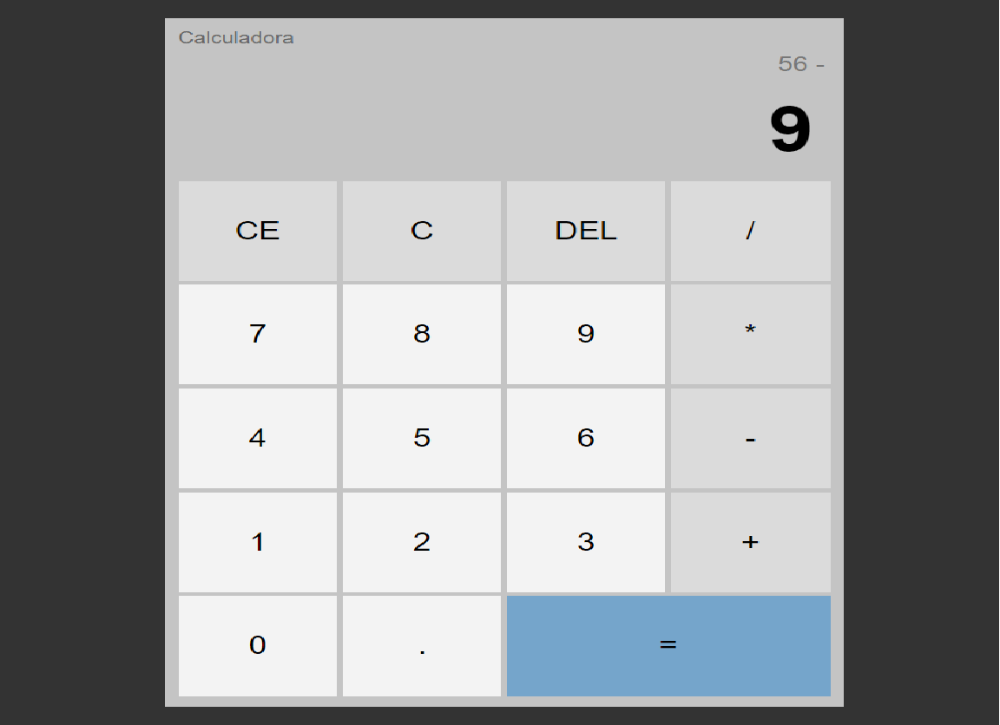

# Calculadora Web 🧮

Esta é uma calculadora simples criada com HTML, JavaScript e CSS.

## Funcionalidades ✨

- Realiza operações matemáticas básicas (adição, subtração, multiplicação, divisão).
- Botões numéricos e de operação.
- Limpeza total (C) e limpeza de entrada (CE).
- Exclusão de dígitos (DEL).
- Atualização em tempo real do visor.
- Interface amigável e responsiva.

## Como Usar 🚀

1. Clone este repositório.
2. Abra o arquivo `index.html` em seu navegador.
3. Clique nos botões numéricos e de operação para fazer cálculos.
4. Use os botões "C" para limpar tudo, "CE" para limpar a entrada atual e "DEL" para apagar um dígito.

## Estrutura de Arquivos 📂

- `index.html`: Estrutura HTML da calculadora.
- `css/styles.css`: Estilos CSS para a aparência da calculadora.
- `js/scripts.js`: Lógica JavaScript para as funcionalidades da calculadora.

## Contribuição 🤝

Contribuições são bem-vindas! Sinta-se à vontade para melhorar este projeto. Basta abrir uma issue ou enviar um pull request.

## Licença 📝

Este projeto está licenciado sob a Licença MIT. Consulte o arquivo [LICENSE](LICENSE) para obter detalhes.

